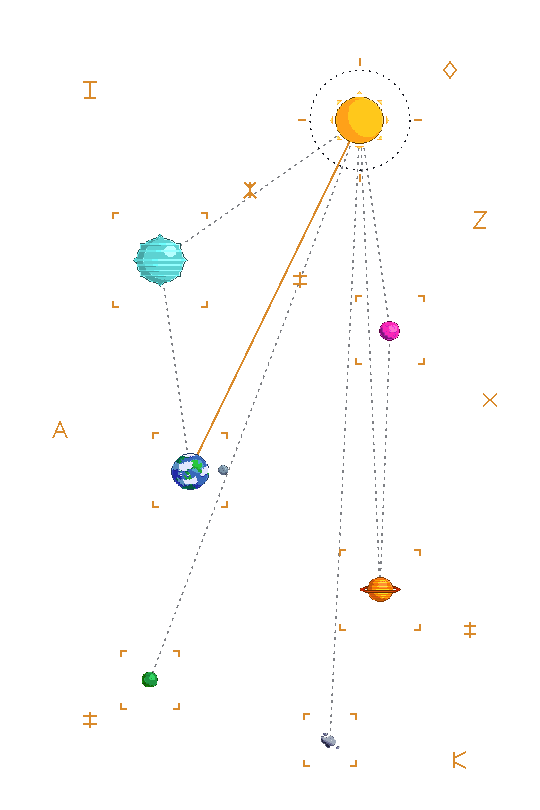

# The banner

The image at the top of the profile README is an animated, transparent SVG
that swaps scenes with your GitHub theme:

- **Dark** — a black hole drifting through a starfield, with Earth quietly
  shattering and reassembling every so often (a nod to "Love breaking
  things!").
- **Light** — a target-locked "star chart": the sun as a HUD hub with
  dashed lock rings, dotted lines to every planet, corner brackets that
  chase each planet's drift with a springy overshoot, and a scatter of
  invented rune glyphs.

Both scenes share the same node layout, so switching theme feels like two
readings of one diagram rather than two unrelated images.

## How the theme swap works

GitHub's markdown renderer supports plain HTML `<picture>` with
`prefers-color-scheme` media queries on the `<source>` elements:

```html
<picture>
  <source media="(prefers-color-scheme: dark)" srcset="img/space-banner-dark-v2.svg">
  <source media="(prefers-color-scheme: light)" srcset="img/space-banner-light-v13.svg">
  
</picture>
```

The browser evaluates the media queries itself and picks one `<source>` —
this is more reliable than putting `@media (prefers-color-scheme)` *inside*
an SVG that's loaded via ``, which doesn't consistently follow the
viewer's theme across browsers. The `` at the bottom is the real
fallback for anything that ignores `<picture>` (some feed readers, npm's
README view).

One gotcha: GitHub's asset proxy caches these files aggressively by URL. If
you edit an SVG and the old version keeps showing, rename the file — that's
why the filenames carry a version suffix (`-v2`, `-v13`, ...) instead of
being edited in place.

## How the art was made

Both scenes are built entirely from vector `<path>` elements — no embedded
raster images. Each pixel-art sprite (planets, moons, the sun, the black
hole) was vectorized from its source PNG using the contour-meshing engine
from **[GLORP](https://github.com/ZackGphom/GLORP)**, which walks each
color's region boundaries and emits one compact SVG path per color instead
of one shape per pixel. That keeps the files small and lets the art stay
pixel-crisp at any size instead of blurring when scaled.

The scenes themselves — positions, the starfield, the rune glyphs, the
target brackets, all the CSS animations — are generated by small Python
scripts rather than hand-written SVG. See [`source/`](source/) for those
scripts and the reasoning behind a few non-obvious choices:

- Every moving piece separates its *static position* (an SVG `transform`
  attribute) from its *animation* (a CSS `transform` on a nested child).
  Putting both on the same element doesn't compose — the CSS animation
  silently replaces the attribute-based position, which is why an early
  version of this banner had every planet collapse onto one point.
- Rotation that needs to happen around a specific point other than an
  element's own center (an orbiting moon, say) uses SMIL `<animateTransform
  type="rotate" ... cx cy>` instead of CSS `transform-origin`, which is
  ambiguous once nested transforms are involved.
- The scene thins out its own detail at small render sizes: `@media
  (max-width: ...)` inside the SVG's `<style>` evaluates against how big the
  *image itself* is actually being displayed (a neat side effect of SVG's
  own viewport establishing a media context), not the page's viewport — so
  small orbiting moons and the asteroid quietly disappear on a narrow
  screen instead of turning into an unreadable smear.

## Credits

- **Sprites** (planets, moons, sun, black hole): the "Freepixel" pack by
  **JIK-A-4** — <https://jik-a-4.itch.io/freepixel>. Unlicense (public
  domain equivalent); no generative AI was used in making it.
- **Vectorization**: [GLORP](https://github.com/ZackGphom/GLORP) (c) 2026
  ZackGphom — non-commercial use, credit required.
